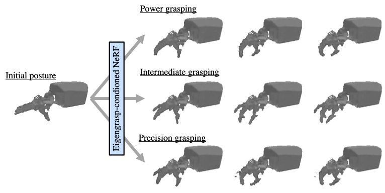

# Eigengrasp-Conditioned Neural Radiance Fields
PyTorch implementation for "Eigengrasp-Conditioned Neural Radiance Fields" (under review).

**Abstract:**

In this study, we address the problem of learning a posture-controllable three-dimensional (3D) representation of articulated robotic hands. Neural radiance fields~(NeRFs) have outperformed grid-like 3D representations on a novel view synthesis tasks; however, rendering novel views while controlling the joints and posture of robotic hands using NeRFs is still challenging. Conventional methods address this problem by explicitly conditioning the posture or by introducing individual part-wise NeRFs. However, they are unable to scale with respect to the number of joints, thereby causing poor convergence or poor rendering performance. Based on the assumption that the difficulty in controllability results from high-dimensional inputs, we propose a NeRF conditioned on a fixed-length and low-dimensional posture representation. Specifically, we employ the eigengrasp representation to control the joints and posture of robotic hands. This strategy is called the eigengrasp-conditioned neural radiance field~(Eigengrasp-NeRF). To evaluate the effectiveness of our method, we conduct experiments in which a novel robotic hand dataset that comprises multi-view images with various camera poses and postures is rendered. The experimental results reveal that our method allows the control of joints while maintaining the rendering quality of the original NeRF, outperforming the pose-conditioned NeRF. Moreover, our method generalizes to unknown grasping behaviors when trained on a dataset that covers the grasping taxonomy.

**Repository:**  
This repository includes:
- Project page link: [URL](https://drive.google.com/drive/folders/16aRzCYkhRGhvi98RJhsG5lR4N3BTo335?usp=sharing)
- Requirements: [requirements.txt](requirements.txt)
- Dataset download link (Google drive): [Honda Robotic Hand Dataset]()
- Training scripts: [single behavior setting](run_train_single_behavior.sh) / [multiple beheviors setting](run_train_multiple_behaviors.sh)
- Evaluation scripts: [single behavior setting](run_test_single_behavior.sh) / [multiple beheviors setting](run_test_multiple_behaviors.sh)

**Acknowledgement:**  
Our code is built upon the [nerf-pytorch](https://github.com/yenchenlin/nerf-pytorch.git).

**Paper:**  
Hiroaki Aizawa (Hiroshima univ.) and Itoshi Naramura (Honda R&D), "Eigengrasp-Conditioned Neural Radiance Fields", under review.